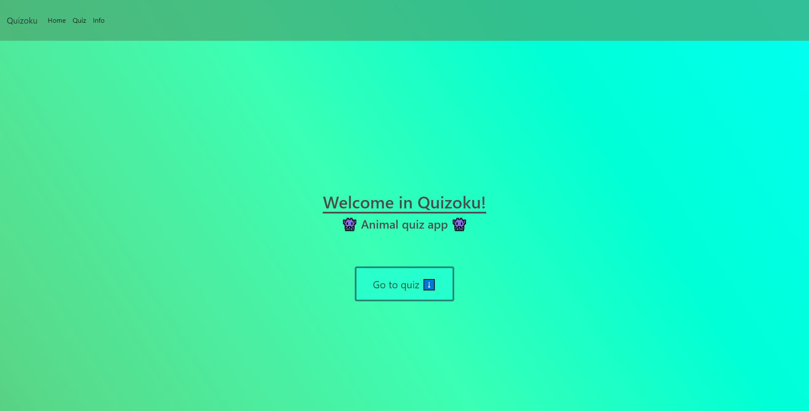
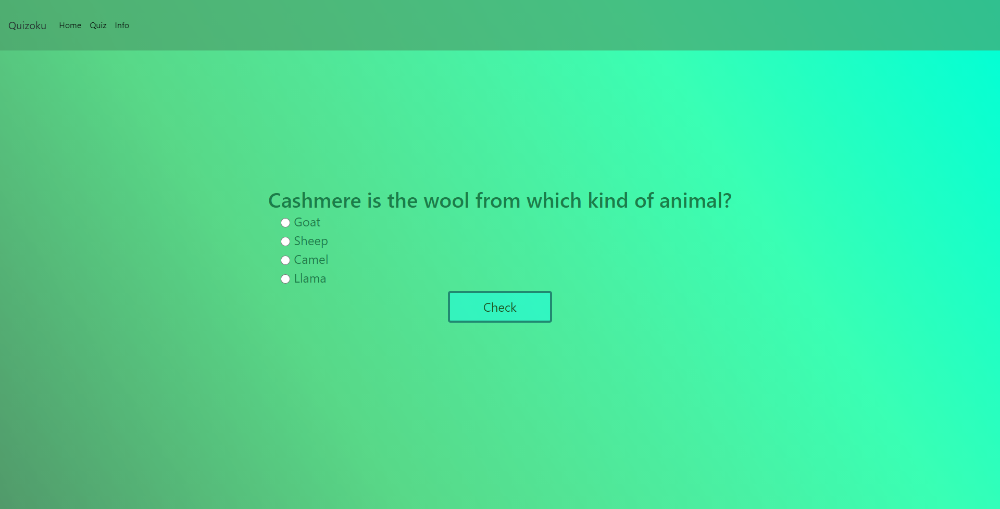
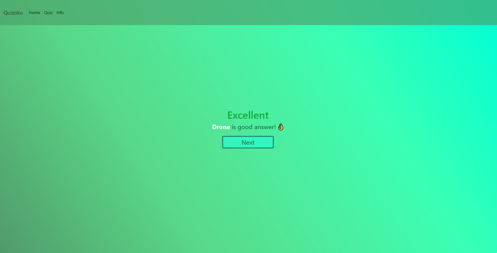
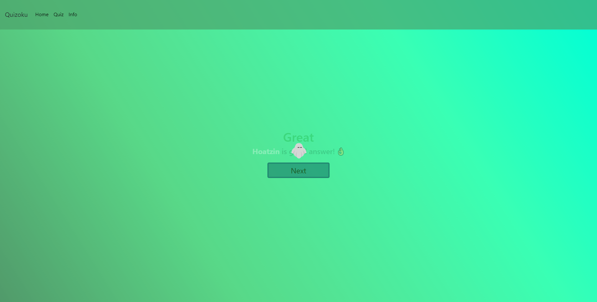

[](https://www.djangoproject.com/)

# Quizoku
Simple quiz about animals written in python using Django framework and PostgreSQL.

## Technologies
Project is created with:
* Python 3
* Django 3.2
* PostgreSQL
* Bootstrap 4.0

## Screens from quiz

<h3>Welcome page:</h3>
<p>
  
</p>

<h3>Quiz:</h3>
<p>
  
  
  
  
</p>


## Usage
* Clone this repository:
```sh
git clone https://github.com/MiiiZawadzki/QuizokuApp.git
cd QuizokuApp
```
* Install dependencies:
```sh
pip install -r requirements.txt
```
* Run app:
```sh
python manage.py runserver
```
* And go to `http://127.0.0.1:8000/`.
